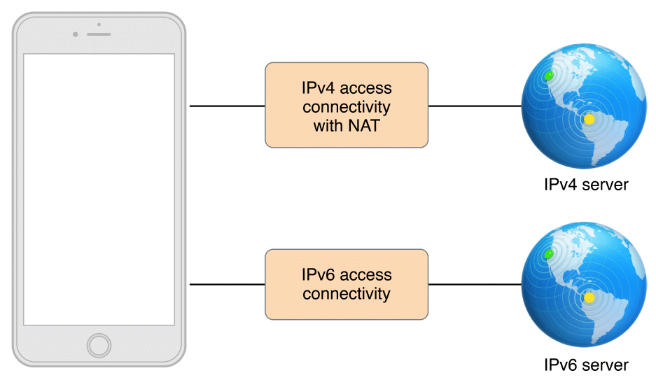
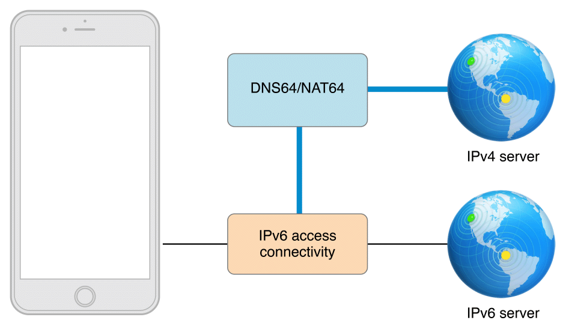
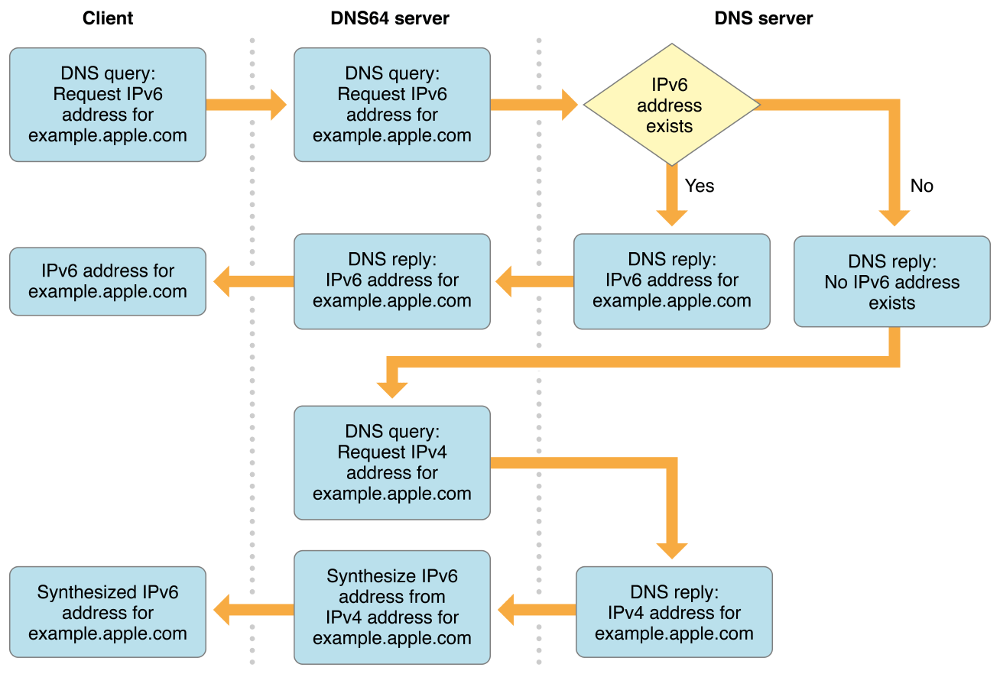
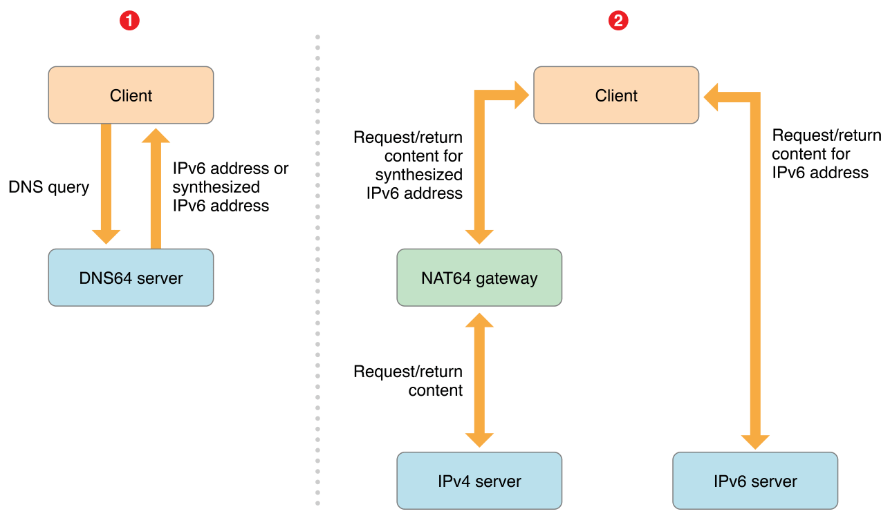

# IPv4ToIPv6

苹果规定：2016年6月1日提交到App Store必须支持IPv6-only网络。
苹果审核IPv6的标准是应用在IPv6的网络环境下和最新的iOS系统下,应用也能正常连接。但是IPv6的客户端是不能直接连接IPv4的服务端，需要通过DNS64或者NAT64的转换地址才能连接。
大多数应用App不需要任何改变，因为IPv6标准已经被NSURLSession、CFNetwork、NSURLConnection支持。

### 一. 判断是否需要修改代码
1. 如果线上环境的App只使用域名访问，没有使用IP地址，并且没有使用底层socket API, 就不用修改代码。
直接访问IP地址 主要是用在测试环境中。
大多数app使用的：NSURLSession、NSURLConnection、UIWebView、WKWebView、CFNetwork。所以可以不用修改网络代码，AFNetworking2.x、reachability 这些都不用做任何的改变。 
不过还是推荐大家升级AFNetworking到最新版本。
用Swift写的就直接用Alamofire吧。

2. Reachability不用IP地址，可以固定写死为线上域名。也可以用AFNetworking的Reachability来判断网络连接状态(是异步的，不用输入域名或IP)

3. iOS 9.0、OS X 10.11 以上的系统在IPv6的环境下，是支持IP地址访问网络的。所以大家测试机如果是iOS9.0以上的系统，可以直接通过IP访问。这是因为iOS 9.0之后 NSURLSession 和 CFNetwork 能把IPv4的地址合成IPv6的地址（在DNS64/NAT64网络环境中）。iOS 9.0以下的系统就会报错，这和是否升级 AFNetworking 没有关系。就算升级AFNetworking到3.x，也是一样会报：Error Domain=NSURLErrorDomain Code=-1001 等错误。

### 二. 现有App支持IPv6的情况
1. 绝大多数 都是支持IPv6的，比如：QQ，淘宝、大众点评。
    1. 因为绝大多数的app 都使用的域名，而不是IP地址。

    2. 并且没有调用底层的socket api。

    3. 不需要进行DNS查找。

2. 极少数app不支持IPv6，比如：微信.

### 三. DNS64/ NAT64
 DNS64/NAT64过渡工作流程:

 1、提供独立的IPv4和IPv6连接 的 蜂窝网络，把IPv4的网络升级到IPv6
 

 上图只是理想状态下，升级到IPv6的情况，但是现在绝大多数都是IPv4的服务器，所以一些大的供应商开始实施DNS64/NAT64 的过度来支持IPv6.

 2、部署DNS64/NAT64 IPv6的蜂窝网络
  

  客户端请求网站域名，首先会通过DNS64服务器查询该域名是否存在IPv6的地址，如果存在，就返回IPv6的地址。如果不存在，就去查找该域名对应的IPv4地址，并返回.

  下面是详细流程图：
  

  3、DNS64/NAT64 转换流程:
  DNS64/NAT64 可以将IPv4地址转换为IPv6，将IPv6地址解析成IPv4。
  IPv4地址转换为IPv6:
  客户端访问网站域名,如果网站只有IPv4地址: 56.111.211.22,转成16进制: 38 6F D3 16, 该16进制为IPv6的最后2位: 64:ff9b::386F:D316
  